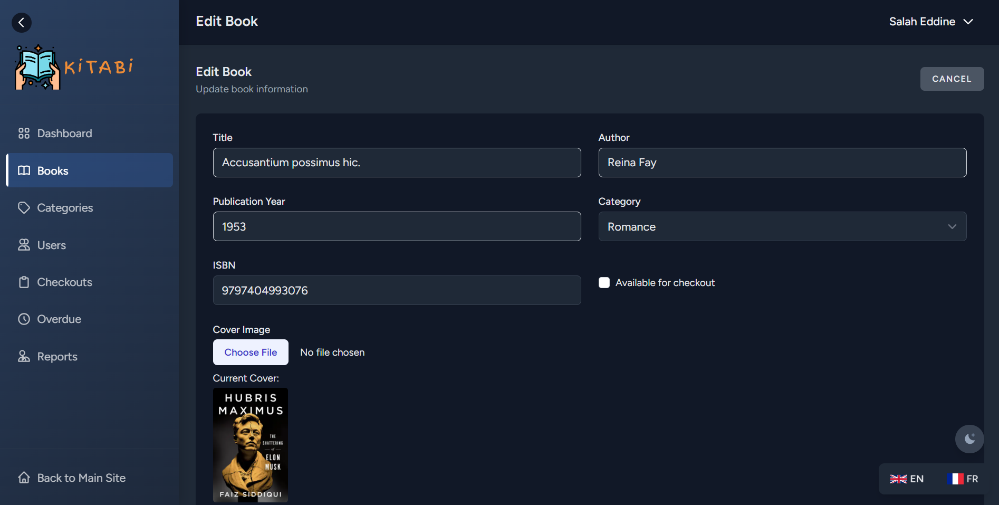

# Kitabi Library Management System

> **Watch the Kitabi Demo:** [YouTube Video](https://youtu.be/lZVzDYnsSMo)
>
> Click the image above or the link to watch a full walkthrough and demonstration of Kitabi Library Management System.

> **Showcase Project — Not for Public Use or Contributions**
>
> This repository is for portfolio and demonstration purposes only. It is intended to showcase my Laravel, MVC, and frontend skills, and to explain how the Kitabi project works. Not intended for production or collaborative development.

---

## Project Overview

Kitabi is a modern library management system built with Laravel. It features a clean UI, strict MVC architecture, and advanced frontend techniques. This project demonstrates my ability to design, implement, and document a full-featured web application from scratch.

---

## Why Kitabi? (Skills Demonstrated)

- **MVC Architecture:** All business logic is in controllers/models, never in views.
- **Blade Components:** Extensive use of reusable Blade components for UI consistency.
- **Theming:** Fully supports dark and light modes with TailwindCSS.
- **Localization:** Uses Laravel's translation system; easily extendable to new languages.
- **Custom Features:**
  - FAQ with JS toggle (no Alpine.js)
  - Best Sellers slider/grid with dynamic data
  - Admin dashboard with analytics
- **Clean Code:** Readable, maintainable, and well-documented throughout.

---

## Key Features

- User authentication (admin/user)
- Browse, search, and filter books
- Detailed book pages with related books
- Category management (admin)
- Book checkout/return system
- Admin dashboard with statistics and quick actions
- Reports and analytics for admins
- Dark/light theme toggle
- Language switcher (EN/FR)

---

## Technical Highlights

- **Backend:** Laravel (PHP), MySQL
- **Frontend:** Blade, TailwindCSS, custom JS
- **Auth:** Laravel Breeze
- **Components:** Located in `resources/views/components/`
- **Translations:** In `resources/lang/en/general.php`
- **Best Sellers:** Book model uses `scopeBestsellers()` for ranking
- **FAQ:** Uses Blade + JS for toggle, translations for questions/answers

---

## How the Project Works

- All user/admin pages are Blade views, using data passed from controllers
- No direct DB/model queries in views
- Sidebar, navbar, FAQ, and other UI elements are Blade components
- Theming and localization are available on every page
- Book and category management are admin-only features
- The welcome page features a Best Sellers slider and dynamic statistics

---

## Screenshots & Demo

### User Interface Pages

#### Home Page

##### Home Page Light Mode

##### Home Page French lang Dark Mode

### Books Page

##### Books Page Light Mode

##### Books Page Dark Mode

### Book Details Page

### Best Sellers Page

##### Best Sellers Dark Mode

##### Best Sellers Light Mode

### Categories Page

##### Categories Light Mode

##### Categories Dark Mode

### Checkouts Page

##### Checkouts Light Mode

##### Checkouts Dark Mode

### Authentication Pages

##### User Login Page

##### Admin Login Page

### Admin Dashboard Pages

#### Main Dashboard

##### Dashboard Light Mode

##### Dashboard Dark Mode

#### Book Management

##### Books List View Light Mode

##### Books List View Dark Mode

##### Book Details View Light Mode

##### Book Details View Dark Mode

##### Book Edit Page Light Mode

##### Book Edit Page Dark Mode

#### Category Management

##### Categories List View Light Mode

##### Categories List View Dark Mode

##### Category Details

##### Add Book to a Category

##### Add Category

##### Edit Category

#### Checkout Management

##### Checkouts

##### Overdue Checkouts

#### User Management

#### Statistics and Reports

##### Dashboard Statistics

---

## Contact

For questions or to discuss my work, reach me via [GitHub](https://github.com/salaheddineaz47) or email : salaheddine.aitzenni@gmail.com .

---

© 2025 Kitabi. All rights reserved.
